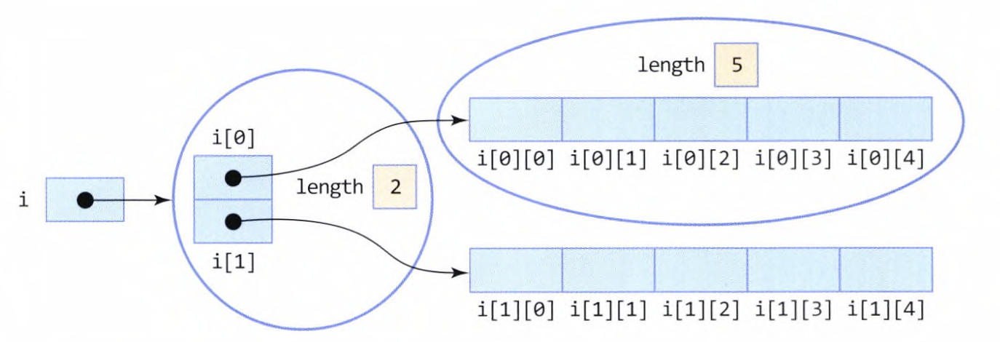

# JAVA

# 다차원 배열 선언 순서와 메모리
* 백준 문제를 풀며, 배열이 차지하는 공간과 관련해서 궁금증이 생겼다.
* 배열의 순서에 따라, (예를 들어, int arr[10][2]와 int arr[2][10]) 메모리 사용량이 다르다고 한다. 이유를 알아보자.
* in JAVA에서..
    * JAVA에서 2D 배열은 1D 배열의 배열로 이며, 모든 객체는 요소를 저장하는 용도 외에도 헤더가 필요하다.
    * 아래의 예는 32비트 JVM을 가정한다.
    * 즉, int arr[10][2]는 10개의 1D 배열을 담는 배열까지 총 배열 객체 11개와 2개의 요소로 구성된 10개의 배열이 필요하다.
        * 합계 11개의 배열 객체, 30개(배열을 담는 배열에서 10개 + 요소 20개)의 요소가 필요하다.
    * 반면, int arr[2][10]은 2개의 1D 배열을 담는 배열까지 총 배열 객체 3개와 10개의 요소로 구성된 2개의 배열이 필요하다.
        * 합계 3개의 배열 객체, 22개의 요소 필요.
    * 헤더 크기가 3개의 32비트 워드(32비트 JVM의 경우)이고 참조가 1개의 32비트 워드라고 가정하면
    * int arr[10][2] : 11*3 + 30*1 = 63워드 = 252바이트 소요
    * int arr[2][10] : 3*3 + 22*1 = 31워드 = 124바이트 소요
* 결론 : 가장 큰 차원을 가장 오른쪽에 쓰면 더 적은 메모리를 사용할 수 있다.
    * [다차원 배열과 메모리](https://stackoverflow.com/questions/15339296/does-order-in-a-declaration-of-multidimensional-array-have-an-influence-on-used/15339442#15339442)
    * [공간 지역성](https://eli.thegreenplace.net/2015/memory-layout-of-multi-dimensional-arrays)


## Scanner, java.util.Scanner
* Scanner는 System.in 객체를 받아 바이트단위로 들어오는 입력을, 토큰 단위로 만들어 반환한다.
    * Scanner scanner = new Scanner(System.in); // 의존성 주입??
    * **프로그램 내에서 System.in은 하나를 공유해서 사용한다. 즉, Scanner 또한 하나의 객체만 생성하고 공유함이 바람직하다.**
    * nextLine()은 '\n'이 나올때까지 입력을 받는다.
    * next(), nextInt(), nextDouble().... 들은 토큰 단위로 즉, '\n', '\t', ' '과 같은 공백문자를 기준으로 끊는다.
    * **nextLine()은 엔터키가 입력되면 "" 빈 문자열을, next()는 엔터키가 입력되도 문자열이나 숫자 등 다른 키의 입력을 기다린다. next()는 절대 빈 문자열을 반환하지 않는다.**
    * hasNext()는 현재 입력된 토큰이 있으면 true, 아니면 입력이 들어올 때 까지 대기하고 true를 리턴. ctrl+z가 입력되면 false를 리턴한다.
    * Scanner는 사용 후 반드시 close() 해준다.


## 예외처리, Exception
* 실행시간 오류와 예외의 차이점: 예외는 잡아서(catch) 적절한 방법으로 대응(handling) 가능, 실행시간 오류는 논리적 오류인 경우가 많다.(무한 재귀호출 등..)
* Java에서 예외처리는 try-catch-finally를 이용한다. finally는 생략 가능하다.
    ```
    try {
        예외가 발생할 수 있는 부분
    } catch (처리할 예외 타입 선언) {
        예외 처리 부분
    } finally {
        예외 발생 여부와 상관없이 무조건 실행되는 문장
    }
    ```
* try 블록 내에서 예외가 발생하면, 자바 플랫폼은 catch문에 '처리할 예외 타입선언'부에 객체를 만들어 전달한다.
    * 객체에는 예외에 대한 정보가 담겨있다.
* 자주 사용되는 Exception (대부분은 java.lang 패키지에 포함)
    * ArithmeticException: 정수를 0으로 나눌 때
    * NullPointerException: null 레퍼런스를 참조하려 할 때
    * ClassCastException: 변환할 수 없는 타입으로 객체를 변환하려 할 때
    * OutOfMemoryException: 메모리가 부족할 때
    * ArrayIndexOutOfBounds: 배열의 범위를 벗어났을 때
    * IllegalArgumentException: 잘못된 인자 전달 시
    * IOException: 입출력 동작 실패 또는 인터럽트 발생 시   **java.io**
    * NumberFormatException: 문자열이 나타내는 숫자와 다른 타입의 숫자로 변환 시 발생
    * InputMismatchException: Scanner 클래스의 nextInt()로 정수입력을 기다릴 때, 사용자가 문자를 입력하는 것과 같이 타입이 맞지않는 입력이 들어올 때    **java.util**


## Switch
* Switch는 여러 조건 분기를 작성할 때, if 대신 사용하여 가독성을 높여준다.
    * Java의 Switch-case는 'break;'를 명시적으로 작성해야 한다. 그렇지 않으면 다음 case문의 '실행문장'을 계속해서 실행한다.
        * case를 검사하지 않고 왜 실행문장을 계속 실행하는지는, switch의 구조를 보면 알 수 있다.
        * c, c++ 등에서 switch는 레이블과 goto로 구현된다. 
        * ">
    * Java의 Switch는 **정수, 문자, 문자열**이 가능하다. case문에는 **정수, 문자, 문자열의 '리터럴'**만이 올 수 있다.

## Array, 배열
* 배열은 같은 타입의 변수들의 집합으로 볼 수 있다.
    * Java의 배열은 1. 레퍼런스 변수 선언 2. 배열 할당 두 단계로 생성한다.
    * 레퍼런스 변수는 배열의 주소 값을 가질 뿐, 배열 그 자체는 아니다.
    * Java의 배열은 객체로서, 배열의 크기를 저장하는 length필드를 갖는다. 
    * 또한, Java의 배열은 음수 인덱싱을 지원하지 않는다.
    * Java에서 for문을 이용하여 배열이나, enum 타입의 원소를 순차적으로 접근할 수 있다. 이를 for-each문 이라 한다.
    ```
    for (int k : intArr) {
        ;
    }
    ```
    * 다차원 배열과 비정방형 배열
    * Java의 다차원 배열(2차원 배열을 기준으로)의 구성.
        * int intArr[][] = new int[2][3];   // 2차원 배열에서 행의 각 원소는 1차원 배열에 대한 레퍼런스가 된다.
        * 
    ```
    int intArr[][] = new int[2][3];     // 2행 3열의 배열 생성.

    int intArr2[][] = new int[2][];     // 0번째 행은 2열, 첫번째 행은 4열까지 존재하는 비정방향 배열
    intArr2[0] = new int[2];
    intArr2[1] = new int[4];
    ```

* 배열을 반환하는 메서드
    * Java에서 메서드가 배열을 반환할 때, 공간 전체가 아니라 레퍼런스 변수만이 반환된다.
    * **아래 메서드에서 temp가 가리키는 힙 공간은 메서드가 종료되도 사라지지 않는다.**
    ```
    public int[] makeArr() {
        int temp[] = new int[4];
        return temp;    // 지역변수 temp는 소멸한다.
    }
    ```

* 메서드 오버로딩
    * method overloading은 이름이 같지만 매개변수의 타입이나 개수가 서로 다른 여러개의 메서드를 중복 작성하는 것을 의미한다.
    * **중요한 점, 메서드의 리턴 타입이나 접근지정자는 메서드 오버로딩과 관련이 없다.**

* **메서드의 인자 전달방법**
    * **Java의 argument passing은 '값에 의한 호출(Call-by-value)'이다.**
    * 호출하는 실인자의 값이 '복사되어' 메서드의 매개변수에 전달된다.
    * primitive type이 전달되는 경우, 실인자의 값으로 매개변수를 초기화시킨다.
    * 객체가 전달되는 경우, **객체의 레퍼런스**가 전달된다.
    * Java의 배열은 객체이므로, 배열이 전달되는 경우도 위와 같다.
         
* **this()**
    * 일반적으로 this는 실행되고 있는 메서드를 포함한 객체 자신에 대한 레퍼런스를 의미한다.
    * this() 메서드는 **생성자 내에서 다른 생성자를 호출할 때 사용한다.**
        * **this()는 반드시 생성자의 첫 문장에 사용되어야 한다.**
    * 다음과 같이 작성할 수 있다.
    ```
    public Class Book {
        String name;
        String title;
        public Book() {
            this("", "");
        }
        public Book(String name) {
            this(name, "");
        }
        public Book(String name, String title) {
            this.name = name;
            this.title = title;
        }
    }
    ```

* Garbage와 Garbage Collection
    * Java에는 직접적으로 객체를 삭제할 수 있는 메서드가 없다.
    * 대신 Java에서는 더 이상 참조되지 않는 객체를 Garbage로 분류하며, 이는 JVM의 Garbage Collector에 의해 회수되어 **가용 메모리풀**로 반환된다.
        * 참조하는 레퍼런스 변수가 없는 객체.
    * 이 일련의 과정을 가비지 컬렉션이라고 하며, **가비지 컬렉션은 자바 플랫폼에 의해 준비된 가바지 컬렉션 스레드**에 의해 처리된다.
    * 일반적으로 JVM 내부의 판단에 따라 실행되지만, 가용 메모리가 부족한 상황에도 자동으로 실행된다.
    * 가비지 컬렉터가 실행되면, 일시적으로 응용 프로그램은 실행을 멈추며, 가비지 컬렉션이 끝날때까지 대기한다.
    * 응용 프로그램에서 System 또는 Runtime 객체의 gc() 메서드로 가비지 컬렉션을 요청할 수 있다.
        * **다만 이는 요청일 뿐, 이로써 즉시 실행되지는 않으며 가비지 컬렉션은 자바 플랫폼이 전적으로 판단하여 적절한 시점에 작동시킨다.**

* 접근 지정자 (access specifier)
    * Java는 서로 연관있는 클래스들을 패키지로 묶어 관리한다.
    
    * Class 접근 지정자, **Class 접근 지정은 public과 default만이 존재** (private이나 protected로 클래스 선언 불가)
        * public : 패키지에 상관없이 다른 어떤 클래스에서도 사용이 가능하다.
        * default(접근 지정자 생략) : 같은 패키지 내에 클래스에서만 사용이 가능하다.
    * 멤버 접근 지정자
        * public : 패키지에 상관없이 모든 클래스들이 멤버에 접근 가능.
        * **protected : 같은 패키지 내 모든 클래스 + 이 클래스를 상속받은 자식 클래스**
        * default(접근 지정자 생략) : 같은 패키지 내에 클래스에서만 접근 가능.
        * private : 비공개, 동일 클래스 내의 멤버들에게만 접근 허용.
        
* static 멤버는 클래스 로딩시(객체 생성시가 아님)에 생성되며, 하나만 생성되어 **동일한 클래스의 모든 객체들이 공유한다.**
    * static 멤버는 '클래스명.멤버' 또는 '객체명.멤버'로 접근 가능하다.
    * static의 특성을 이용해, 응용 프로그램 전체에서 공유하는 전역 변수, 전역 메서드를 대체할 수 있다.
    * **static 메서드는 객체 생성 이전부터 사용할 수 있으므로, static 멤버에만 접근 가능하며, 메서드 내부에서 this를 사용할 수 없다.**

* **final**
    * final 키워드는 3 군데에서 사용된다.
        1. final 클래스
            * 클래스 앞에 final이 붙으면, 이는 '더 이상 상속될 수 없는 클래스'임을 의미한다.
            * 즉, final class를 상속받는 sub class를 만들지 못한다.
        2. final 메서드
            * 이는 '오버라이딩 할 수 없음'을 의미한다.
            * 자식 클래스가 부모 클래스 메서드를 오버라이딩 하지 못하고, 무조건 상속받아 사용하게끔 하기 위해 사용한다.
        3. final 필드
            * final이 붙은 필드는 '상수'가 된다. **상수 필드는 한 번 초기화 되고나면, 더 이상 값을 변경할 수 없다.**
        

# String, StringBuffer, StringBuilder
* 면접을 보다가 내가 잘 모르고 있는 부분이라 정리한다. StringBuffer, StringBuilder는 입, 출력 단계에서 밖에 잘 안 써봤는데..
* String, StringBuffer, StringBuilder 모두 문자열을 다루는 클래스다. Java는 왜 문자열을 다루는 클래스를 여러 개로 나눠놨을까?
    1. String
        * String은 불변성이 특징이다. String으로 생성한 객체(문자열)는 값이 바뀌지 않는다. 아래 코드를 살펴보자
        ```
        String str = new String("Hello"); // 1번
        str = str + " World"    // 2번
        system.out.println(str);    // Hello World
        ```
        * 위 코드는 str 객체의 값이 바뀌는 것 처럼 보인다.
        * 하지만, 실상은 값이 바뀌는 것이 아닌, 2번에서 값을 변경할 때 새로운 객체가 만들어진다.
        * 그리고 str은 새로 만들어진 객체를 참조한다. 1번에서 만든 메모리 영역은 Garbage로 남아있다가, 후에 GC에 의해 처리된다.
        * String은 immutable(불변성)하다. 즉, 문자열을 수정하는 시점에 새로운 인스턴스가 만들어진다.
    2. StringBuffer, StringBuilder
        * StringBuffer와 StringBuilder는 mutable(가변)하다.
        * 이 두 클래스는 append(), delete() 등의 메소드로 동일 객체내에서 문자열 수정이 가능하다.
        * 두 클래스의 차이는 뭘까? 
            * 가장 큰 차이점은 동기화 유무로, StringBuffer는 동기화 키워드를 지원하여 멀티 쓰레드 환경에서 안전(thread-safe)하다는 점이다.
            * 끼어들자면 String도 불변성을 가지기 때문에 thread-safe하다.
            * 반면, StringBuilder 동기화를 지원하지 않는 대신, 동기화를 고려하지 않기 때문에 단일 쓰레드 환경에서 StringBuffer에 비해 성능이 뛰어나다.

# MyBatis, JDBC, DAO, DTO, VO
* DAO, Data Access Object는 데이터베이스에 접근하여 데이터를 조회, 삽입, 수정, 삭제 등의 작업을 수행하는 객체를 말한다.
* 즉, 이 때 SQL문을 사용하여 데이터베이스와 통신하게 된다. 따라서 DAO 클래스는 DB와 직접적으로 관련된 로직을 처리하게 된다.

* DTO, Data Transfer Object는 계층간 데이터를 교환하기 위해 사용하는 객체이다. 
* 이 객체는 로직이 없이 순수한 getter와 setter만을 갖는 클래스이다.
    * 사용 예로는, 유저가 입력한 데이터를 DB에 넣는 경우가 있다.
    * 유저가 브라우저에서 데이터를 입력하여 form에 있는 데이터를 DTO에 실어 전송한다.
    * DTO를 받은 서버는 DAO를 이용하여 DB로 데이터를 집어넣는다.

* VO, Value Object는 값을 저장하는 객체이고 setter가 존재하지 않고 read-only의 특징을 갖는다.
* 즉, 사용 중 값에 수정이 불가능하고 단지 읽기만 가능한 객체이다.
* DTO와 유사하지만 DTO는 setter가 있어 수정이 가능하고 VO는 불가능하다.

* JDBC, Java DataBase Connectivity는 Java를 이용하여 DB에 접속하고, SQL문을 실행하고 결과를 처리하기 위한 API(Application Programing Interface)이다.
* JDBC만을 이용해 SQL문을 사용하려면, 매번 JDBC 드라이버를 로드하고, DB와의 커넥션을 잡고, SQL문 실행 -> 결과 처리 -> 연결 종료의 단계를 거쳐야해서 불편하다.
* 여기서 나온게 SQL문을 XML파일로 분리해 저장하고, Java 코드로 해당 SQL문 id에 매핑되는 메서드를 선언한 인터페이스를 만들어 사용하는 MyBatis이다.

* MyBatis는 Java 코드로 Mapper 인터페이스를 선언하고 그 안에 XML 파일로 작성한 SQL문과 매핑되는 메서드를 선언한다.
* 그리고, DAO 클래스를 구현해서 SqlSessionFactory를 필드로 갖는다. 
* SqlSessinonFactory는 MyBatis의 핵심 인터페이스 중 하나이다. 이는 SqlSession 객체를 생성하는 역할을 한다.
* 이는 SqlSessionFactoryBuilder에 build() 메소드로 Configuration 객체(XML 또는 자바코드)를 빌드하여 생성된다.
* SqlSession은 데이터베이스와의 세션을 담당한다. 즉, 데이터베이스에 대한 커넥션을 가져와 SQL문을 실행하고 반환한다.
* session.getMapper() 메서드는 인터페이스를 인자로 받아 이를 구현한 클래스의 객체를 생성하고 이를 반환한다.
* 이제 mapper 객체를 이용해서 Mapper 인터페이스에 정의된 메서드를 호출하면, Mapper 인터페이스의 메서드 이름과 XML 파일의 id가 매핑되어 해당 SQL문이 실행된다.
* 이로써 우리는 단순히 DAO 클래스를 인스턴스화하고 DAO 클래스의 메서드를 호출하는 것으로 SQL문을 실행할 수 있다.

# JPA, ORM, Persistence, Hibernate
* JPA, Java Persistence API는 Java에서 ORM 기술 표준으로 사용되는 인터페이스의 모음이다.
* 즉, JPA란 Java Application에서 RDBMS를 사용하는 방식을 정의한 인터페이스이다.
* 실제 구현체는 아니며 구현된 클래스와 매핑해주기 위해 사용되는 프레임워크이다.
* JPA의 대표적인 구현체로는 Hibernate가 있다.

* ORM, Oriented-Relational Mapping(객체 관계 매핑)은 객체(class)와 관계형 DB의 테이블을 매핑한다는 뜻이다.
* 기술적으로는 객체를 DB 테이블에 '자동'으로 영속화해주는 것이다.

* Persistence, 영속성이란 데이터를 생성한 프로세스가 종료되어도 데이터는 사라지지 않는 특성을 얘기한다.
* 대부분의 프로그램은 지속적으로 데이터를 보유하고 있을 필요가 있어 영속성을 가지려고 한다.
* 데이터를 파일, RDB, NoSQL 저장소 등에 저장해서 Persistence를 유지할 수 있다.

* Hibernate, Hibernate는 JPA의 구현체 중 가장 많이 사용되는 구현체이다.
* Hibernate를 사용하면 직접 SQL을 호출하지 않아도, Java에서 메소드를 호출하는 것만으로 DB에 CRUD 할 수 있다.

# Hibernate와 MyBatis 
* Hibernate는 ORM, 즉 객체와 관계 데이터베이스의 테이블을 매핑한다. 반면 MyBatis는 XML이나 Java 코드로 분리된 SQL문과 DAO 객체의 메소드를 매핑한다.
* 이점에서 살펴보자면 MyBatis는 ORM의 기술을 사용하긴 하지만, JPA도 ORM도 아니라고 할 수 있다.

