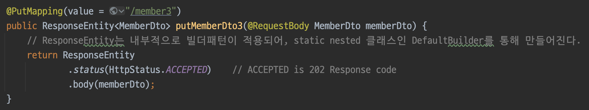
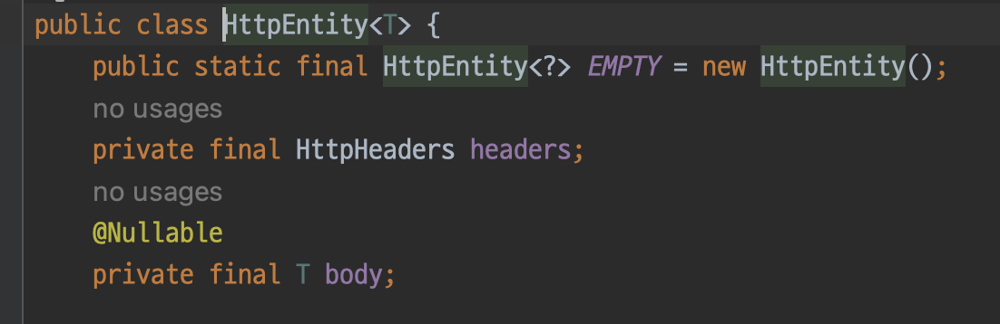
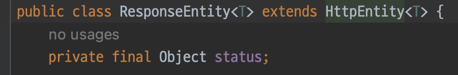
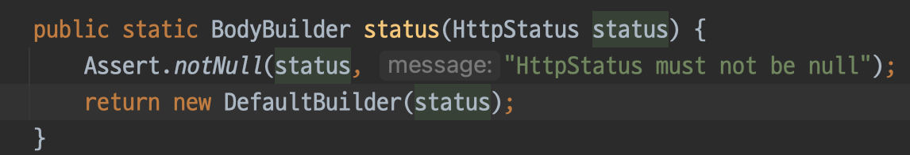
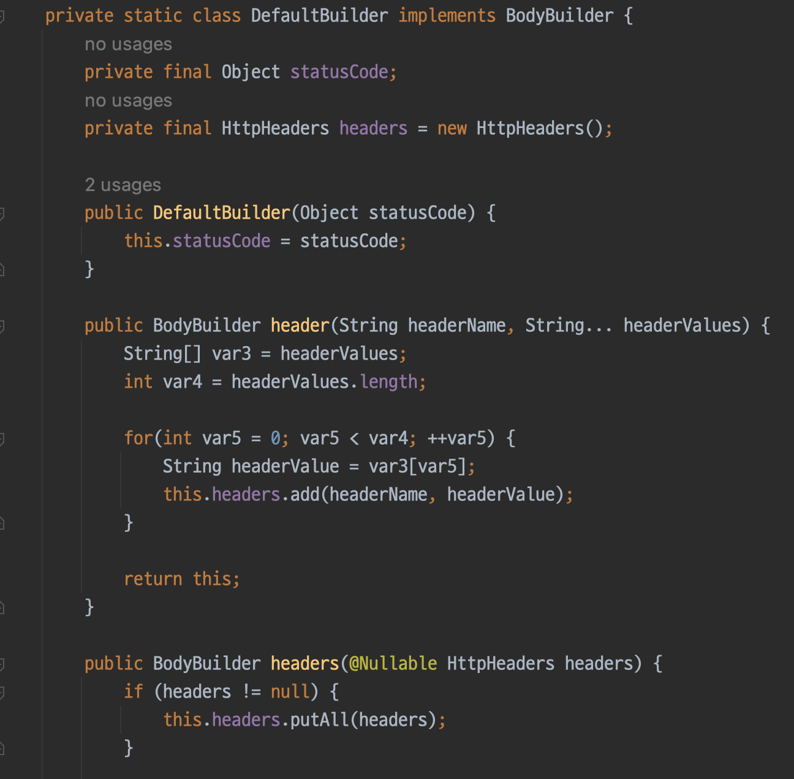
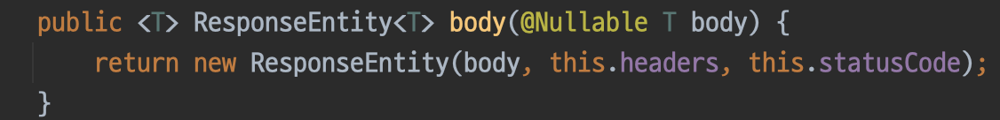
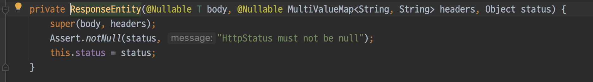

# SpringBoot 


## Builder 패턴과 ResponseEntity.
* 스프링 부트를 공부하다 ResponseEntity를 만났다. 
* 최근에는 클래스 범위에 @RestController 어노테이션을 추가하면, @ResponseEntity를 일일히 추가해주지 않아도 되지만
* 마침 책에 예제가 있었고, 아래와 같은 코드가 어떻게 ResponseEntity 객체를 만들어 반환할 수 있는지 궁금했다.


* 처음에는 ResponseEntity가 Bean으로 관리되는 싱글톤 패턴의 인스턴스인 줄 알았다. 
* 이렇게 잘 못 이해한 이유는 위 사진에서 객체를 생성할 때, 'new' 키워드가 안 보였기 때문이다.

* 그런데 보다보니 익숙한 문장 형식이, 그게 아니였음을 깨닫게 했다. 얼마 전 본 builder 패턴과 객체 생성방식이 같다.
* ResponseEntity는 HttpEntity를 상속받는다. HttpEntity는 HttpHeaders와 body 필드를 갖는다.
* 이를 상속한 ResponseEntity는 status 필드를 갖는데, 이는 우리가 보는 HTTP 응답의 그 상태값과 같은 것이다.
* HttpEntity

* ResponesEntity


* ResponseEntity에 status는 static 메서드이다. status는 static inner class인 DefaultBuilder의 객체를 생성하여 반환한다.


* DefaultBuilder는 다음과 같이 중첩 클래스로 작성되며, HttpHeaders를 필드로 갖는다. 또한, Header에 값을 설정하는 메서드를 포함한다.


* body() 메서드는 최종적으로 ResponseEntity의 생성자를 호출한다.


* 위와 같은 방법으로 ResponseEntity 객체가 생성된다.


## Class의 메타데이터를 참조하는 Class<?> , 클래스 리터럴 '.class'
* Java에서는 '클래스명.class' syntax를 이용해서 클래스 개체에 대한 참조를 가져올 수 있다.
* 이는 일반적인 인스턴스와는 다르며, 런타임에 클래스에 대한 메타데이터를 가지고 작업할 수 있도록 한다.
* 리플렉션(reflection)과 연관되어 많이 사용되지만, 이는 이번 주제의 범위를 벗어나는 이야기이다.
* Java의 모든 클래스는 Object 클래스를 상속한다. 여기서 궁금증이 생겼다. 
    * .class는 Object 클래스에서 선언하여, 모든 클래스들에게 상속되어진게 아닐까?
* [The difference between getClass() and .class](https://www.baeldung.com/java-getclass-vs-class)
* 결론부터 말하자면 이 둘은 조금 다르다.
* 'getClass()'는 Java의 모든 클래스의 최상위 클래스인 Object 클래스에서 정의된 메서드이다.
* 이는 인스턴스의 클래스. 즉, 개체의 런타임 클래스를 반환한다. 
* 반면, '.class'는 클래스를 static하게 평가한다. 또한, 인스턴스가 필요없이 클래스명, 인터페이스명을 가지고 개체를 참조할 수 있다.

* 예시를 살펴보자
    ```java
    public static void main(String[] args) {
        Animal animal = new Monkey();

        Class class1 = animal.getClass();
        Class class2 = Animal.class;
    }
    ```
* 위의 예제에서 class1은 Monkey 클래스의 개체를 참조한다. animal은 실제론 Monkey 클래스의 인스턴스이므로 이와 같은 결과가 나온다.
* class2는 보이는 대로 Animal 클래스의 개체를 참조한다. 즉 이는 Class<Animal>의 레퍼런스이다.

* 이 둘 사이에는 한 가지 큰 차이점이 더 있다. 바로 인스턴스의 유무인데, getClass()는 어디까지나 인스턴스 메서드이기 때문에 객체의 인스턴스를 생성할 수 없다면 사용할 수 없다.
* 이럴 때, 클래스 리터럴(.class 구문)을 사용하면 클래스 개체를 가져올 수 있다.
* 인스턴스를 생성할 수 없는 abstract 클래스나 interface를 생각해보자. 이런 상황에서는 getClass() 대신 '.class' 구문을 사용해야 한다.
* 추가적으로 void 키워드나 원시타입의 경우에도 .class를 사용하면 클래스 개체를 가져올 수 있다.

* 클래스가 아닌, 원시 타입의 클래스 개체를 어떻게 가져온다는 걸까?
* Class 클래스에 isPrimitive() 메서드를 보면 다음과 같이 나와있다.

* JVM은 원시타입의 클래스 개체를 참조하기 위해, 미리 정의된 9개의 클래스 객체를 갖는다.(8개의 원시타입 + void)
* 이는 JVM에 의해 생성되며, 각 타입에 이름과 같은 이름을 갖는 클래스 객체이다. (int, void, char, float ...)
* 이는 Integer.TYPE, Void.TYPE, Character.TYPE과 같은 public static final variable을 통해서만 접근이 가능하다.
* Integer.TYPE, VOID.TYPE, Float.TYPE 등은 각각 int.class, void.class, float.class에 대한 sortcut이다.
[Integer.class vs int.class](https://stackoverflow.com/questions/22470985/integer-class-vs-int-class)

* 이는 어떻게 동작할까?
    * 모든 클래스에 대한 바이트 코드 정보는 Class 객체로 저장된다. 이 Class 타입의 인스턴스를 Runtime Class Object라고 한다.
    * 모든 클래스 파일이 로드되면 JVM은 자동으로 힙 영역에 Class 객체를 생성한다.
    * .class는 이러한 Class 객체를 가져오는 역할을 한다.
    * 이렇게 가져온 클래스 객체를 통해 우리는 생성자, 메서드, 필드, 어노테이션 등의 클래스를 구성하는 메타데이터를 얻을 수 있다.

