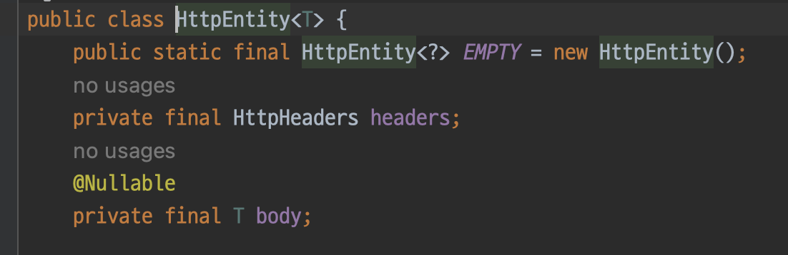
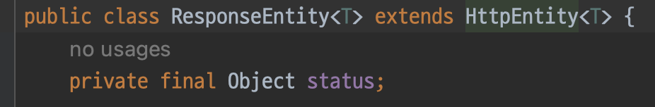
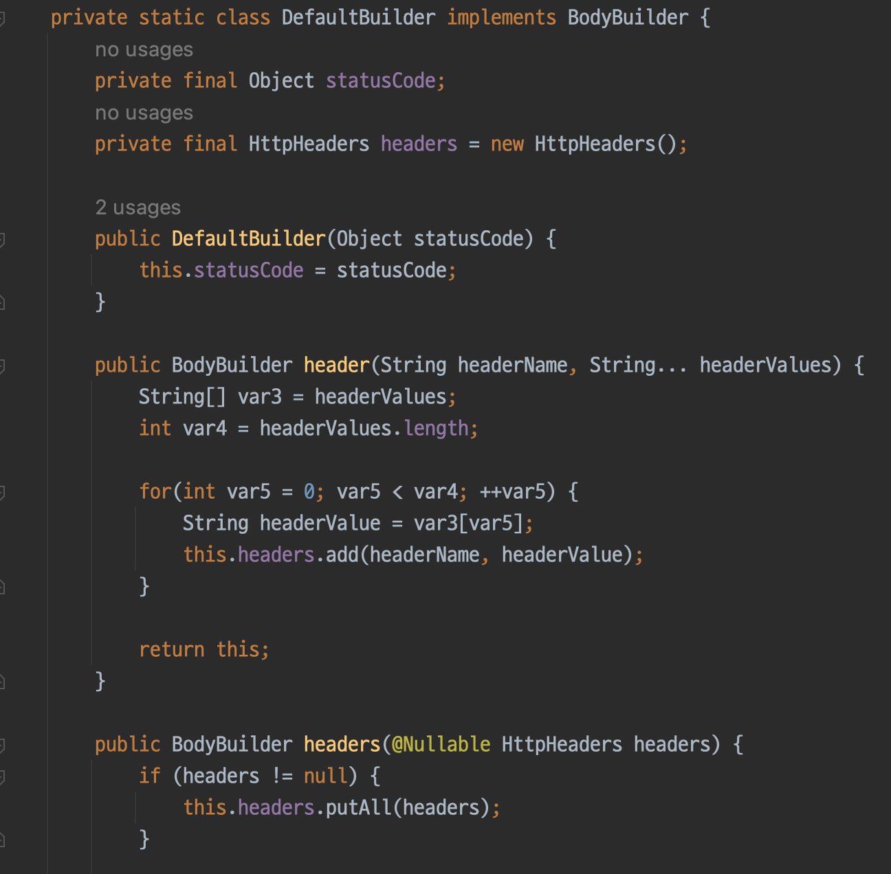
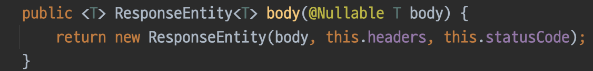
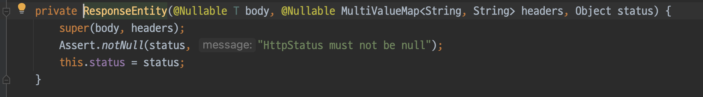
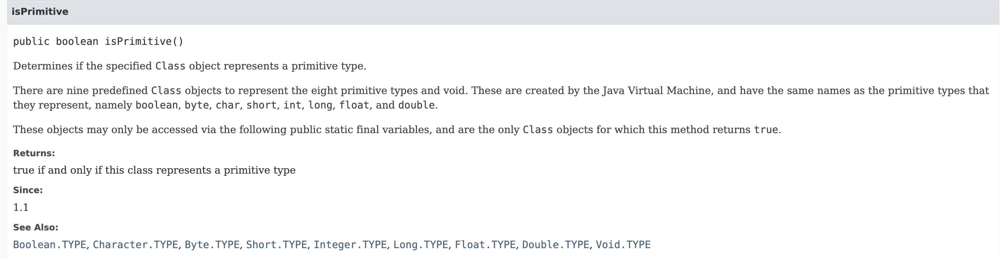

# Spring과 Spring Boot

## 부록. 프로젝트 환경설정
* start.spring.io에서 spring intializer를 이용한다.
* 프로젝트는 Gradle-Grooovy (pom.xml을 사용하는 Maven 대신 가독성이 좋고 더 유연한 Gradle을 사용)
* 언어는 당연히 Java, Java버전은 11 사용. LTS이면서 Java8과 동시에 가장 많이 사용되는 버전!
    * Java 8 : 람다, 스트림, 인터페이스 내 디폴트 메서드, Optional 클래스
    * Java 11 : String 클래스에 repeat, strip등 메서드 추가, 람다 파라미터에 var 사용, HTTP 클라이언트 라이브러리 추가
* 스프링 부트 2.7.x를 사용 (SNAPSHOT은 아직 개발단계임을 의미 => SNAPSHOT이 아닌 GA를 사용하도록 하자.)
* 패키징은 JAR로 사용. Dependencies에서 Spring Web을 추가하면, Tomcat이 Embeding된다. 
* 즉, 내장 톰캣으로 따로 서버를 설치하지 않아도 돌릴 수 있다.
* Dependencies는 Java Web(Spring MVC, Embeded Tomcat Container..)와 Thymeleaf(서버-사이드 템플릿, 디폴트 값 부여.)

## build.gradle
```
plugins {
	id 'java'
	id 'org.springframework.boot' version '2.7.12'
	id 'io.spring.dependency-management' version '1.0.15.RELEASE'
}

group = 'hello'
version = '0.0.1-SNAPSHOT'

java {
	sourceCompatibility = '11'      // Java 버전
}

repositories {
	mavenCentral()      // mavenCentral에서 종속성들을 가져온다.
}

dependencies {
	implementation 'org.springframework.boot:spring-boot-starter-thymeleaf'     // 타임리프 템플릿 엔진 (View)
	implementation 'org.springframework.boot:spring-boot-starter-web'       // Spring Web (톰캣, web MVC) 
    // Spring Starter 공통 라이브러리에는 스프링 부트 + 스프링 코어 + 로깅(logback, slf4j) 등이 추가된다.
    // test를 위한 종속성인데, Junit, mockito, assertj 등 기본적으로 추가된다.
	testImplementation 'org.springframework.boot:spring-boot-starter-test'  
}

tasks.named('test') {
	useJUnitPlatform()
}
```

## 1. 간단하게 돌려보기 (Thymeleaf 사용)
* 스프링 부트에서는 Welcome Page라고 해서, static/index.html을 사이트 전면 페이지로 제공한다. 
```
import org.springframework.stereotype.Controller;
import org.springframework.ui.Model;
import org.springframework.web.bind.annotation.GetMapping;

/*
Controller와 스프링 WEB 작동원리.
Spring MVC의 기본적인 흐름은 Client의 요청은 @Controller에 진입해서 
Controller가 요청에 대한 작업을 수행하고 View로 데이터를 전달한다.

브라우저가 서버에 요청. ex) 'localhost:8080/hello' -> GET 요청임.
내장 톰캣 서버가 스프링부트, 스프링 컨테이너에서 매핑된 메서드를 찾아 실행.(HelloController)
Controller에서 문자 값을 반환하면 'viewResolver'가 해당하는 화면(문자값)을 찾아서 처리
스프링 부트 템플릿 엔진은 기본적으로 viewName 매핑을 지원한다.
viewResolver는 'resources:templates/' + '${viewName: hello}' + '.html' 에서 찾는다.
 */
@Controller
public class HelloController {
    /*
    '@GetMapping("hello")'의 의미?
    =>  Get 메서드를 통해 들어온 요청. 즉, 브라우저가 'localhost:8080/hello'로 서버에 요청했을 때.
    이 메서드를 실행시켜라.
     */
    @GetMapping("hello")
    public String hello(Model model) {      // 모델 객체를 통해 View로 데이터 전달
        model.addAttribute("data", "hello!!");
        /*
        'return "hello";'의 의미?
        =>  resourcse/templates/ 에 있는 'hello'라는 이름의 파일로 넘겨(렌더링해)라 (View 이름을 리턴한다.)
         */
        return "hello";
    }
}
```

## 빌드하고 실행하기 (CLI, iterm 환경)
* CLI 환경에서 스프링 프로젝트를 빌드하고 실행하기
* 프로젝트 폴더로 이동. ex) cd Users/namu/SpringProject/hello-spring
* gradlew를 가지고 빌드하면 된다. ex) ./gradlew build
* 만일 오류가 발생한다면, './gradlew clean'로 삭제 이후 다시 빌드하거나 './gradlew clean build' 사용
* 생성되는 build 디렉토리 안에 libs 디렉토리에서 'hello-spring-0.0.1-SNAPSHOT.jar'의 예시와 같이 생성되는 jar파일을 실행하 면된다.
* java -jar hello-spring-0.0.1-SNAPSHOT.jar를 통해 실행. '^ + c' 키로 종료(mac)


## Builder 패턴과 ResponseEntity.
* 스프링 부트를 공부하다 ResponseEntity를 만났다. 
* 최근에는 클래스 범위에 @RestController 어노테이션을 추가하면, @ResponseEntity를 일일히 추가해주지 않아도 되지만
* 마침 책에 예제가 있었고, 아래와 같은 코드가 어떻게 ResponseEntity 객체를 만들어 반환할 수 있는지 궁금했다.


* 처음에는 ResponseEntity가 Bean으로 관리되는 싱글톤 패턴의 인스턴스인 줄 알았다. 
* 이렇게 잘 못 이해한 이유는 위 사진에서 객체를 생성할 때, 'new' 키워드가 안 보였기 때문이다.

* 그런데 보다보니 익숙한 문장 형식이, 그게 아니였음을 깨닫게 했다. 얼마 전 본 builder 패턴과 객체 생성방식이 같다.
* ResponseEntity는 HttpEntity를 상속받는다. HttpEntity는 HttpHeaders와 bodt 필드를 갖는다.
* 이를 상속한 ResponseEntity는 status 필드를 갖는데, 이는 우리가 보는 HTTP 응답의 그 상태값과 같은 것이다.



* ResponseEntity에 status는 static 메서드이다. status는 static nested class인 DefaultBuilder의 객체를 생성하여 반환한다.


* DefaultBuilder는 다음과 같이 중첩 클래스로 작성되며, HttpHeaders 필드를 갖는다. 또한, Header에 값을 설정하는 메서드를 포함한다.


* body() 메서드는 최종적으로 ResponseEntity의 생성자를 호출한다.


* 위와 같은 방법으로 ResponseEntity 객체가 생성된다.


## Class의 메타데이터를 참조하는 Class<?> , 클래스 리터럴 '.class'
* Java에서는 '클래스명.class' syntax를 이용해서 클래스 개체에 대한 참조를 가져올 수 있다.
* 이는 일반적인 인스턴스와는 다르며, 런타임에 클래스에 대한 메타데이터를 가지고 작업할 수 있도록 한다.
* 리플렉션(reflection)과 연관되어 많이 사용되지만, 이는 이번 주제의 범위를 벗어나는 이야기이다.
* Java의 모든 클래스는 Object 클래스를 상속한다. 여기서 궁금증이 생겼다. 
    * .class는 Object 클래스에서 선언하여, 모든 클래스들에게 상속되어진게 아닐까?
* [The difference between getClass() and .class](https://www.baeldung.com/java-getclass-vs-class)
* 결론부터 말하자면 이 둘은 조금 다르다.
* 'getClass()'는 Java의 모든 클래스의 최상위 클래스인 Object 클래스에서 정의된 메서드이다.
* 이는 인스턴스의 클래스. 즉, 개체의 런타임 클래스를 반환한다. 
* 반면, '.class'는 클래스를 static하게 평가한다. 또한, 인스턴스가 필요없이 클래스명, 인터페이스명을 가지고 개체를 참조할 수 있다.

* 예시를 살펴보자
```
public static void main(String[] args) {
    Animal animal = new Monkey();

    Class class1 = animal.getClass();
    Class class2 = Animal.class;
}
```
* 위의 예제에서 class1은 Monkey 클래스의 개체를 참조한다. animal은 실제론 Monkey 클래스의 인스턴스이므로 이와 같은 결과가 나온다.
* class2는 보이는 대로 Animal 클래스의 개체를 참조한다. 즉 이는 Class<Animal>의 레퍼런스이다.

* 이 둘 사이에는 한 가지 큰 차이점이 더 있다. 바로 인스턴스의 유무인데, getClass()는 어디까지나 인스턴스 메서드이기 때문에 객체의 인스턴스를 생성할 수 없다면 사용할 수 없다.
* 이럴 때, 클래스 리터럴(.class 구문)을 사용하면 클래스 개체를 가져올 수 있다.
* 인스턴스를 생성할 수 없는 abstract 클래스나 interface를 생각해보자. 이런 상황에서는 getClass() 대신 '.class' 구문을 사용해야 한다.
* 추가적으로 void 키워드나 원시타입의 경우에도 .class를 사용하면 클래스 개체를 가져올 수 있다.

* 클래스가 아닌, 원시 타입의 클래스 개체를 어떻게 가져온다는 걸까?
* Class 클래스에 isPrimitive() 메서드를 보면 다음과 같이 나와있다.

* JVM은 원시타입의 클래스 개체를 참조하기 위해, 미리 정의된 9개의 클래스 객체를 갖는다.(8개의 원시타입 + void)
* 이는 JVM에 의해 생성되며, 각 타입에 이름과 같은 이름을 갖는 클래스 객체이다. (int, void, char, float ...)
* 이는 Integer.TYPE, Void.TYPE, Character.TYPE과 같은 public static final variable을 통해서만 접근이 가능하다.
* Integer.TYPE, VOID.TYPE, Float.TYPE 등은 각각 int.class, void.class, float.class에 대한 sortcut이다.

* 이는 어떻게 동작할까?
    * 모든 클래스에 대한 바이트 코드 정보는 Class 객체로 저장된다. 이 Class 타입의 인스턴스를 Runtime Class Object라고 한다.
    * 모든 클래스 파일이 로드되면 JVM은 자동으로 힙 영역에 Class 객체를 생성한다.
    * .class는 이러한 Class 객체를 가져오는 역할을 한다.
    * 이렇게 가져온 클래스 객체를 통해 우리는 생성자, 메서드, 필드, 어노테이션 등의 클래스를 구성하는 메타데이터를 얻을 수 있다.

